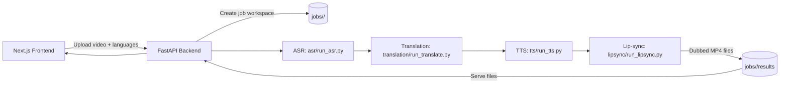
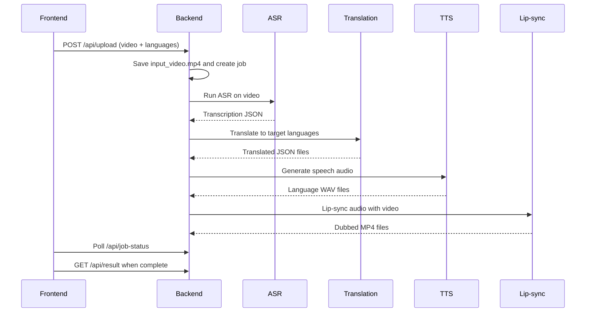

# VidioLingua

AI-powered video localization pipeline: transcribe (ASR), translate (MT), synthesize speech (TTS), and produce lip-synced dubbed videos.

---

## At a Glance





---

## Quick Start (Commands Only)

From the project root, refresh dependencies:

```bash
pip install -r requirements.txt
cd frontend-next
npm install
```

Start the backend in one terminal:

```bash
uvicorn backend.main:app --reload --host 0.0.0.0 --port 8000
```

Start the frontend in another terminal:

```bash
cd frontend-next
npm run dev
```

Open `http://localhost:3000` (or `3001` if `3000` is busy). In the app, switch **API Mode** to **Real API** on the Architecture page.

---

## How It Works (Detailed Process)

1. **Upload and job creation**
   - The frontend submits the video to `POST /api/upload` with selected languages.
   - The backend saves it as `jobs/<job_id>/input_video.mp4` and creates job state.
2. **Background pipeline**
   - The backend starts a background thread that orchestrates all stages.
   - Each stage is run as a standalone script for clear separation and debugging.
3. **ASR (transcription)**
   - The video is copied into `asr/input/`.
   - `asr/run_asr.py` produces a transcription JSON in `asr/output/`.
4. **Translation**
   - Transcription JSON is copied to `translation/input/`.
   - `translation/run_translate.py` translates to target languages from `VIDIOLINGUA_TARGET_LANGUAGES`.
5. **Text-to-Speech**
   - Translated JSON files are copied into `tts/input/`.
   - `tts/run_tts.py` generates one WAV per language in `tts/output/`.
6. **Lip-sync**
   - The original video and generated audio files are copied into `lipsync/input/`.
   - `lipsync/run_lipsync.py` produces dubbed MP4s in `lipsync/output/`.
7. **Results and download**
   - Output files are copied to `jobs/<job_id>/results/`.
   - The frontend polls `GET /api/job-status/<job_id>` and reads `GET /api/result/<job_id>` when complete.
   - Videos are served via `GET /api/result/<job_id>/file/<filename>`.

---

## API Endpoints

- `GET /api/health` - Basic health check.
- `GET /api/health/deps` - Verify dependencies like ffmpeg and required Python packages.
- `POST /api/upload` - Upload a video and start a job.
- `GET /api/job-status/<job_id>` - Poll job progress and stage.
- `GET /api/result/<job_id>` - Fetch final results or error.
- `GET /api/result/<job_id>/file/<filename>` - Download result assets.

---

## Project Structure

```
vidiolingua/
├── asr/                # ASR stage (Whisper-based transcription)
├── translation/        # Translation stage
├── tts/                # Text-to-Speech stage
├── lipsync/            # Lip-sync stage
├── backend/            # FastAPI API + pipeline orchestrator
├── frontend-next/      # Next.js UI (full demo)
├── frontend/           # Vite UI (alternate)
├── shared/             # Shared contracts
├── jobs/               # Per-job workspaces and results (runtime)
├── demo_inputs/        # Sample inputs
├── demo_outputs/       # Sample outputs
└── requirements.txt
```

---

## Configuration

Environment variables you can set:

- `JOBS_DIR` - Override job workspace location (default: `./jobs`).
- `API_BASE_URL` - Base URL used when returning result links (default: `http://localhost:8000`).
- `PYTHON` - Python executable used to run stage scripts (default: `python`).
- `VIDIOLINGUA_TARGET_LANGUAGES` - Comma-separated language codes for translation (default: `hi,es,fr`).

---

## Troubleshooting

- **Port 3000 in use**: Next.js will fall back to `3001`; use the printed URL.
- **ffmpeg not found**: Install ffmpeg and ensure it is on your PATH.
- **Missing dubbed videos**: Check backend logs; confirm `gTTS` is installed and audio output exists.
- **First ASR run is slow**: Whisper model downloads on first use (~140 MB).

---

## Manual Pipeline Debugging (Optional)

You can run each stage manually for debugging. Copy inputs into each module's `input/` folder, run the script, then copy outputs to the next stage's `input/`.

```bash
python asr/run_asr.py
python translation/run_translate.py
python tts/run_tts.py
python lipsync/run_lipsync.py
```

---

## License

Internal project; add a license if you plan to distribute.
# VidioLingua

AI-powered video localization pipeline: transcribe (ASR), translate, synthesize speech (TTS), and produce dubbed videos.

## Getting Started

### Prerequisites

- **Python 3.10+**
- **Node.js 18+** (for the frontend)
- **ffmpeg** on your PATH (for audio extraction, TTS, and lip-sync)
- **Pipeline dependencies** (one-time): `pip install -r requirements.txt` installs **faster-whisper** (ASR), **deep-translator** (translation), **gTTS** (TTS). First run of ASR will download the Whisper "base" model (~140 MB).

### Run (commands only)

From the project root, refresh dependencies and start both services:

```bash
pip install -r requirements.txt
cd frontend-next
npm install
```

Backend (separate terminal):

```bash
uvicorn backend.main:app --reload --host 0.0.0.0 --port 8000
```

Frontend (separate terminal):

```bash
cd frontend-next
npm run dev
```

Open [http://localhost:3000](http://localhost:3000). Switch to **Real API** on the Architecture page and use the app.

### Backend

From the project root:

```bash
pip install -r requirements.txt
uvicorn backend.main:app --reload --host 0.0.0.0 --port 8000
```

The API will be available at `http://localhost:8000`. Optional env: `JOBS_DIR=./jobs` (default).

### Frontend

For the full demo (upload → pipeline → results), use the Next.js app:

```bash
cd frontend-next
npm install
npm run dev
```

Open [http://localhost:3000](http://localhost:3000). To use the real backend: set `NEXT_PUBLIC_API_URL=http://localhost:8000` in `frontend-next/.env.local`, then on the **Architecture** page switch **API Mode** to **Real API**. Upload a short video, select languages (Hindi, Spanish, French are supported by the pipeline), and run the pipeline; result videos are served by the backend.

For mock-only demos (no backend), leave API Mode as **Mock**.

### Running the pipeline manually (optional)

You can run each stage by hand for debugging: copy inputs into each module’s `input/` folder, run the script, then copy outputs to the next stage’s `input/`.

- ASR: `python asr/run_asr.py`
- Translation: `python translation/run_translate.py` (optional env: `VIDIOLINGUA_TARGET_LANGUAGES=hi,es,fr`)
- TTS: `python tts/run_tts.py`
- Lip-sync: `python lipsync/run_lipsync.py`

---

## High-Level Architecture Overview

VidioLingua follows a modular pipeline architecture where video processing flows through four independent stages: Automatic Speech Recognition (ASR), Machine Translation (MT), Text-to-Speech (TTS), and Lip Synchronization. Each stage operates as a self-contained module with dedicated input/output folders, communicating through file-based interfaces. The pipeline enforces unidirectional data flow—each stage reads from the previous stage's output and writes to its own output folder, ensuring clear separation of concerns and enabling parallel development. A shared contracts file defines the data format specifications between stages, maintaining consistency across the pipeline. The architecture is designed for Windows environments with beginner-friendly, low-risk modularity.

## Complete Folder Structure

```
C:\vidiolingua\
│
├── asr\
│   ├── input\
│   ├── output\
│   └── run_asr.py
│
├── translation\
│   ├── input\
│   ├── output\
│   └── run_translate.py
│
├── tts\
│   ├── input\
│   ├── output\
│   └── run_tts.py
│
├── lipsync\
│   ├── input\
│   ├── output\
│   └── run_lipsync.py
│
├── demo_inputs\
│   └── sample_video.mp4
│
├── demo_outputs\
│
├── shared\
│   └── contracts.json
│
├── backend\
│   ├── main.py           # FastAPI app (upload, job-status, result, file serving)
│   ├── job_store.py      # In-memory job state
│   └── pipeline_runner.py # Orchestrator (ASR → Translation → TTS → Lipsync)
│
├── frontend-next\        # Next.js app (main UI)
├── frontend\             # Vite app (simple alternate UI; use frontend-next for full demo)
├── jobs\                 # Created at runtime; per-job workspaces and results
├── requirements.txt
└── README.md
```


## Folder and File Descriptions

### Root Directory: `C:\vidiolingua\`

The main project root containing all pipeline modules and shared resources.

### `asr\`

**Purpose:** Automatic Speech Recognition module that extracts spoken text from video files.

- **`asr\input\`**: Receives video files from the demo_inputs folder or previous pipeline stages.
- **`asr\output\`**: Contains transcribed text output (typically JSON or text files with timestamps and transcriptions).
- **`run_asr.py`**: Entry point script that processes video files in the input folder and generates transcriptions in the output folder.

### `translation\`

**Purpose:** Machine Translation module that translates transcribed text into target languages (Hindi, Spanish, French).

- **`translation\input\`**: Receives transcription files from the ASR module's output.
- **`translation\output\`**: Contains translated text files for each target language, maintaining timing information.
- **`run_translate.py`**: Entry point script that reads transcriptions and generates translations for all target languages.

### `tts\`

**Purpose:** Text-to-Speech module that converts translated text into speech audio files.

- **`tts\input\`**: Receives translated text files from the translation module's output.
- **`tts\output\`**: Contains generated audio files (one per target language) with speech synthesized from translated text.
- **`run_tts.py`**: Entry point script that processes translated text and generates audio files for each language.

### `lipsync\`

**Purpose:** Lip Synchronization module that synchronizes generated audio with video lip movements.

- **`lipsync\input\`**: Receives both the original video file and generated audio files from TTS output.
- **`lipsync\output\`**: Contains final dubbed video files with lip-synced audio for each target language.
- **`run_lipsync.py`**: Entry point script that combines video and audio to produce lip-synced dubbed videos.

### `demo_inputs\`

**Purpose:** Storage location for sample input videos used for testing and demonstration.

- **`demo_inputs\sample_video.mp4`**: Placeholder for a sample English video file (1-3 minutes) used for POC testing.

### `demo_outputs\`

**Purpose:** Storage location for final processed videos after the complete pipeline execution.

- Empty folder where final dubbed videos (one per target language) will be placed after successful pipeline completion.

### `shared\`

**Purpose:** Contains shared configuration and contract definitions used across all pipeline stages.

- **`shared\contracts.json`**: Defines data format specifications, file naming conventions, and interface contracts between pipeline stages to ensure consistent communication.

### `requirements.txt`

**Purpose:** Python dependency manifest listing all required packages and libraries for the entire pipeline.

